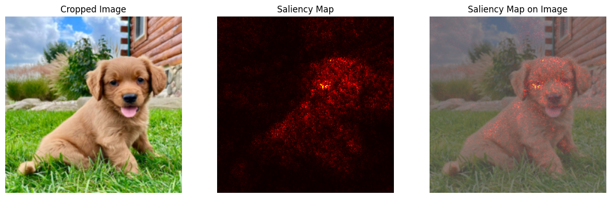

# Interpretability Library

This minimal library provides tools for visualizing and understanding the decisions made by deep learning models. 

## Features

- Load pretrained models such as ResNet-50 and VGG16.
- Compute saliency maps for a given model and input image.
- Display saliency maps and heatmaps on top of the input image.

## Usage

1. Load a pretrained model using the `load_resnet50` or `load_vgg16` function from `model_loader.py`.
2. Compute the saliency map for a given input image and model using the `compute_saliency_map` function from `interpretability.py`.
3. Display the saliency map on top of the input image using the `display_saliency_map` function from `visualization.py`.  
  
See the [example.ipynb](example.ipynb) notebook for a detailed walkthrough of using these functions.  

## Example

